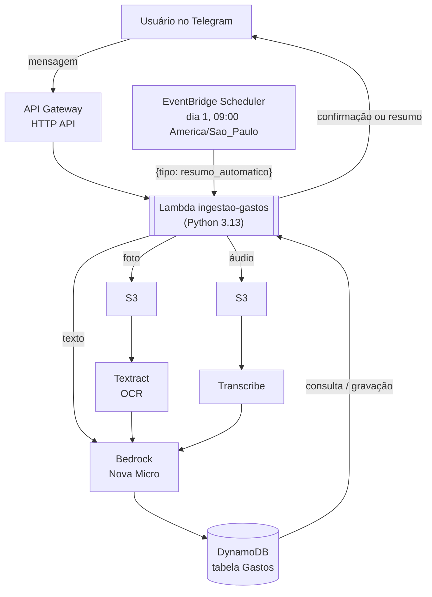

# Agente de Controle de Gastos

Bot no Telegram que registra gastos do dia a dia por texto, áudio ou foto de comprovante, usando IA generativa para extrair os dados estruturados, e devolve um resumo mensal agregado automaticamente ou sob demanda. Construído 100% em serviços serverless da AWS.

## Visão geral

A ideia central: registrar um gasto deveria ser tão simples quanto mandar uma mensagem. O usuário conversa com um bot no Telegram por texto, áudio ou foto de um comprovante, e o agente entende o que foi gasto, onde e como foi pago, sem precisar preencher formulário nenhum. Automaticamente todo dia 1 ele devolve um resumo agregado por categoria e forma de pagamento.

O projeto foi pensado originalmente para rodar sobre o WhatsApp, mas migrou para o Telegram no meio do caminho por uma restrição de política da Meta.

## Arquitetura

A Lambda é o único ponto de orquestração do sistema: recebe o evento (seja do API Gateway, seja do EventBridge), decide o que fazer e chama os outros serviços da AWS conforme o caso. Não há fila, orquestrador ou máquina de estados: para o volume de uso (pessoal, poucas mensagens por dia), uma função síncrona dá conta do fluxo inteiro sem complexidade extra.

## Como funciona

O sistema atende a três fluxos diferentes, todos passando pela mesma Lambda:

**1. Registrar um gasto.** O usuário manda uma mensagem de texto ("gastei R$ 40 no mercado, no crédito"), um áudio falando a mesma coisa, ou uma foto de um comprovante. A Lambda extrai o texto bruto (direto, ou via Transcribe/Textract), manda para o Bedrock com um prompt que pede a extração estruturada (valor, local, categoria, forma de pagamento) em JSON, e salva o resultado no DynamoDB. Se o modelo não identificar um valor válido, nada é salvo e o usuário recebe apenas um aviso.

**2. Resumo sob demanda.** O usuário manda a mensagem "resumo" (ou "resumo 2026-08" para um mês específico) e a Lambda consulta todos os gastos daquele mês no DynamoDB, agrega os totais por categoria e por forma de pagamento, e devolve o relatório formatado na hora.

**3. Resumo automático mensal.** Todo dia 1 às 9h (horário de Brasília), o EventBridge Scheduler invoca a mesma Lambda com um payload específico (`{"tipo": "resumo_automatico"}`), sem nenhuma interação do usuário. A função calcula sozinha qual foi o mês anterior, gera o resumo e manda a mensagem para o chat do usuário no Telegram.

## Decisões técnicas

**Bedrock (Nova Micro) em vez de um pipeline de regras/NLP próprio.** Regras manuais ou expressões regulares quebram fácil com variações de linguagem natural ("gastei", "paguei", "comprei", áudio transcrito com erros etc.). Usar um modelo de linguagem via Bedrock, com um prompt que pede uma saída em JSON estruturado, resolve isso com muito menos código e generaliza melhor. O Nova Micro foi escolhido por ser o modelo mais barato do Bedrock adequado para uma tarefa de extração simples.

**Telegram em vez de WhatsApp.** A API do WhatsApp Business (Meta) bloqueia o número de teste para enviar mensagens a números brasileiros (erro 130497), sem alternativa viável para uso pessoal sem custo. O Telegram tem uma API de bot muito mais simples de configurar, e o restante da arquitetura (Lambda, Bedrock, Textract, Transcribe, DynamoDB) não precisou mudar, só a camada de entrada/saída de mensagens.

**Modelagem do DynamoDB (PK/SK).** A tabela usa uma chave de partição fixa (`PK = "USER#eu"`, já que é uso pessoal de um único usuário) e uma chave de ordenação que embute a data em formato ISO (`SK = "GASTO#2026-09-20T...#<id>"`). Isso permite consultar todos os gastos de um mês específico com uma única `query` eficiente (usando `begins_with` no prefixo `GASTO#2026-09`), sem precisar varrer a tabela inteira.

**Uma única função Lambda.** Em vez de separar em várias funções, o projeto usa uma única Lambda que decide o que fazer com base no formato do evento recebido. Para o volume e a complexidade do projeto, isso reduz a superfície de configuração à custa de um `lambda_handler` um pouco maior, uma troca razoável nesta escala.

## Desafios e soluções

**Bloqueio do WhatsApp (erro 130497).** Resolvido pivotando o canal de entrada para o Telegram.

**Permissões IAM incompletas.** Vários erros por falta de permissão da role da Lambda ao longo do desenvolvimento: `AccessDeniedException` no Bedrock (acesso ao modelo precisou ser solicitado), `SubscriptionRequiredException` no Textract (resolvido ativando o serviço na conta) e `InvalidS3ObjectException` (causado pela falta da policy `AmazonS3FullAccess` na role).

**Modelo Bedrock exigindo inference profile.** A chamada direta ao `amazon.nova-micro-v1:0` falhava com "on-demand throughput isn't supported". Resolvido usando o inference profile (`us.amazon.nova-micro-v1:0`).

**Webhook do Telegram com erro 400/404.** O 404 veio de uma rota mal configurada no API Gateway (precisava de uma rota `ANY /`). O 400 foi causado por esquecer de clicar em **Implantar** no console depois de atualizar o código.

**Qualidade da extração em produção.** Mensagens sem relação com gastos estavam sendo registradas vazias, e um comprovante de Pix não teve o valor identificado corretamente. Corrigido ajustando o prompt do Bedrock (regras para reconhecer comprovantes bancários) e adicionando uma verificação: se o modelo não retornar um valor válido, a Lambda não salva nada.

## Stack

- **AWS Lambda** (Python 3.13) — orquestração de todo o fluxo
- **Amazon API Gateway** (HTTP API) — recebe o webhook do Telegram
- **Amazon Bedrock** (Nova Micro, via inference profile) — extração de dados estruturados por IA generativa
- **Amazon Textract** — OCR de comprovantes
- **Amazon Transcribe** — transcrição de áudio
- **Amazon DynamoDB** — armazenamento dos gastos
- **Amazon S3** — armazenamento temporário de áudios e imagens
- **Amazon EventBridge Scheduler** — disparo mensal automatizado
- **Amazon CloudWatch + SNS** — alarmes de erro e de custo, logs estruturados
- **AWS IAM** — roles e policies
- **Terraform** — infraestrutura como código (pasta [`infra/`](./infra))
- **Telegram Bot API** — canal de entrada e saída de mensagens

## Infraestrutura como código

A pasta [`infra/`](./infra) descreve em Terraform toda a infraestrutura acima — Lambda, API Gateway, DynamoDB, S3, IAM, EventBridge Scheduler e os alarmes do CloudWatch — como ela roda hoje em produção. Não foi aplicada contra os recursos reais (eles foram criados manualmente durante o aprendizado), mas serve como referência fiel e como prática de IaC. Detalhes de como rodar num ambiente separado estão no README daquela pasta.

## Monitoramento e observabilidade

- **Logs estruturados em JSON** na Lambda (função `log_evento`), cobrindo os principais eventos do fluxo — facilita consultas no CloudWatch Logs Insights.
- **Alarme de erros da Lambda**: dispara se a função lançar 1 ou mais erros em uma janela de 5 minutos, notificando por e-mail via SNS.
- **Alarme de gastos estimados (billing)**: dispara se os encargos estimados da conta AWS no mês ultrapassarem um valor limite (US$ 5), notificando pelo mesmo canal, importante para não ter surpresa de fatura enquanto o projeto está em teste.

## Custos estimados

Para o volume de uso pessoal deste projeto, a maior parte dos serviços fica dentro da camada gratuita da AWS. Bedrock, Textract e Transcribe são cobrados por uso (tokens, páginas e segundos, respectivamente), mas com uso pessoal moderado o custo mensal fica na casa de centavos a poucos reais. O alarme de billing (acima) monitora isso automaticamente.

## Possíveis evoluções futuras

- **Testes automatizados**
- **Pipeline de CI/CD**
- **Suporte a múltiplos usuários**
- **Policies IAM mais restritas** (hoje a Lambda usa policies gerenciadas amplas da AWS para Bedrock/Textract/Transcribe/S3; o ideal seria restringir só às ações necessárias)
